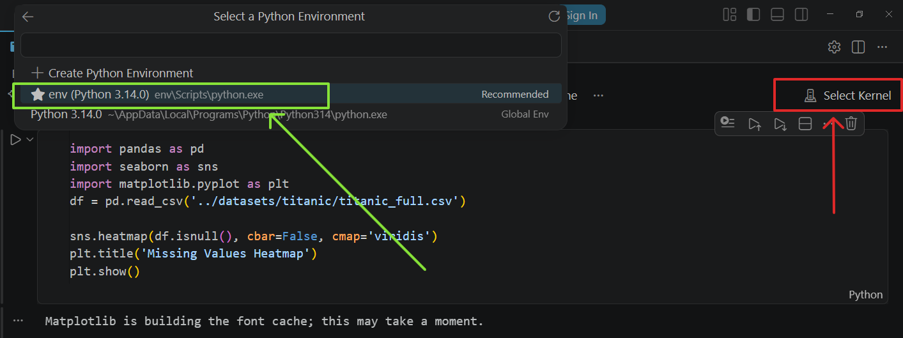

# 📘 Machine Learning Lab Setup Guide

This repository contains Jupyter Notebook (`.ipynb`) files for learning and practicing Machine Learning concepts.

This guide will help you set up your local development environment using Python and Visual Studio Code.

---

# ⚙️ Prerequisites

Make sure the following tools are installed on your system:

- Python (version 3.10 or higher)
- Git
- Visual Studio Code (VS Code)
- Git Bash ( Terminal Commands )

---

# 🚀 Getting Started

## 1. Clone the Repository

```bash
git clone https://github.com/MrShadow03/CSE-0613-3206-Machine-Learning
cd CSE-0613-3206-Machine-Learning
```

## 2. Create a Virtual Environment

```bash
python -m venv venv
```
* Activate the Environment
```bash
source venv/bin/activate
```

## 3. Install Dependencies

```bash
pip install -r requirements.txt
```
* Or You can install manually! 

```bash
pip install numpy pandas matplotlib seaborn jupyter
```
We'll update the `requirements.txt` file when we import new Library

## 4. Open Project in VS Code

```bash
code .
```
<br>

# 🧪 Extentions

1. [Jupyter by Microsoft](https://marketplace.visualstudio.com/items?itemName=ms-toolsai.jupyter)
2. [Python by Microsoft](https://marketplace.visualstudio.com/items?itemName=ms-python.python)

<br>

# 📓 Run Notebooks

1. Open any `.ipynb` file!
2. Select `env` karnel we've created



# 🧩 Troubleshooting
* You may have to restart the VS Code if codes doesn't run or keeps loading. 

Everything was tested on Windows 10/11 Devices. If you face any issues, fell free to create a `issue`. 